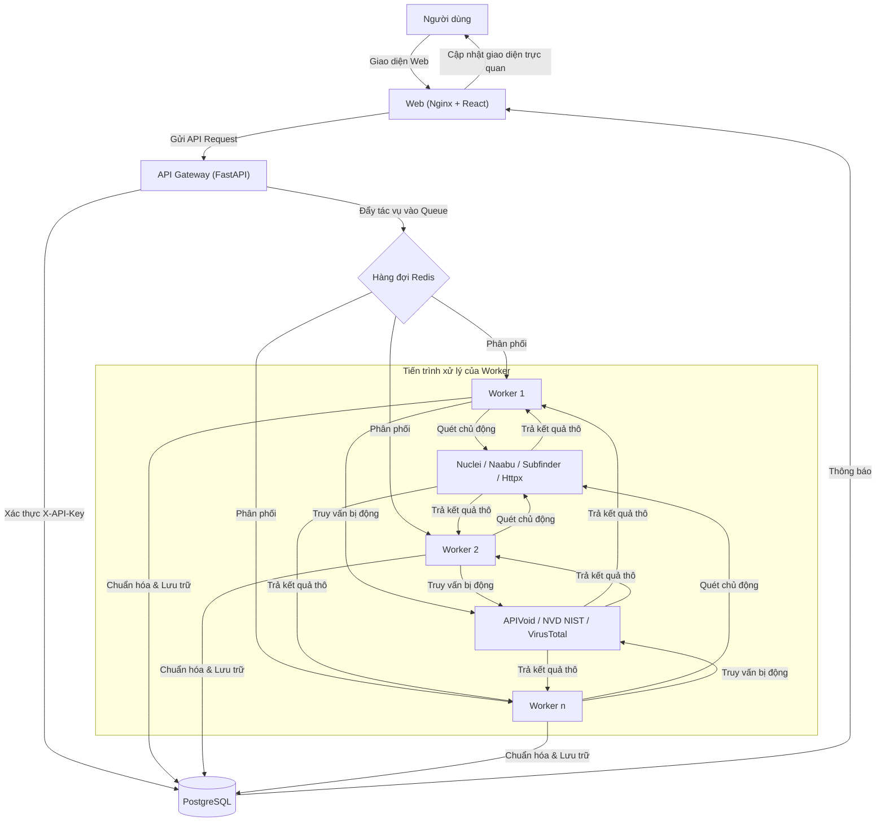

# 🛡️ Recon Platform (v2.0) — Hệ Thống Trinh Sát & Phân Tích An Ninh Mạng Toàn Diện

[](https://fastapi.tiangolo.com/)
[](https://reactjs.org/)
[](https://www.docker.com/)
[](https://www.postgresql.org/)
[](https://redis.io/)
[](https://www.python.org/)

**Recon Platform** là một hệ thống trinh sát và phân tích an ninh mạng tập trung, được thiết kế theo mô hình **"All-in-one"**. Nền tảng này không chỉ cung cấp các công cụ quét đơn thuần mà còn kết hợp khả năng phân tích dữ liệu thông minh (Threat Intelligence) từ các nguồn uy tín toàn cầu và dữ liệu lỗ hổng bảo mật thời gian thực.

---

## 📖 Mục Lục
- [1. Kiến Trúc Kỹ Thuật Hệ Thống](#1-kiến-trúc-kỹ-thuật-hệ-thống)
  - [1.1. Thành Phần Hệ Thống](#11-thành-phần-hệ-thống)
  - [1.2. Sơ Đồ Luồng Dữ Liệu Phức Hợp](#12-sơ-đồ-luồng-dữ-liệu-phức-hợp)
- [2. Đặc Tả Chi Tiết Tính Năng](#2-đặc-tả-chi-tiết-tính-năng)
  - [2.1. Discover - Khám Phá Bề Mặt Tấn Công](#21-discover---khám-phá-bề-mặt-tấn-công)
  - [2.2. Email Security Analyzer](#22-email-security-analyzer)
  - [2.3. IP \& Domain Reputation](#23-ip--domain-reputation)
  - [2.4. SSL Analyzer](#24-ssl-analyzer)
  - [2.5. CVE Intelligence](#25-cve-intelligence)
  - [2.6. Hands-on Labs (Phòng Thực Hành Bảo Mật)](#26-hands-on-labs-phòng-thực-hành-bảo-mật)
- [3. Hướng Dẫn Triển Khai & Cấu Hình](#3-hướng-dẫn-triển-khai--cấu-hình)
  - [3.1. Cấu Hình Môi Trường (.env)](#31-cấu-hình-môi-trường-env)
  - [3.2. Hướng Dẫn Khởi Chạy](#32-hướng-dẫn-khởi-chạy)
- [4. Quy Trình Vận Hành Kỹ Thuật (SOP)](#4-quy-trình-vận-hành-kỹ-thuật-sop)
- [5. Tích Hợp & Thử Nghiệm API](#5-tích-hợp--thử-nghiệm-api)
- [6. Tuyên Bố Miễn Trừ Trách Nhiệm](#6-tuyên-bố-miễn-trừ-trách-nhiệm)

---

## 1. Kiến Trúc Kỹ Thuật Hệ Thống

### 1.1. Thành Phần Hệ Thống

Hệ thống được vận hành trên nền tảng Docker với các container chuyên biệt:

| Dịch vụ (Service) | Công nghệ chính | Vai trò & Chức năng |
| :--- | :--- | :--- |
| **Web Frontend** | `React` + `Vite` + `Nginx` | Cổng giao diện người dùng. Nginx được cấu hình để phục vụ các tệp tĩnh của React và thực hiện reverse-proxy cho các yêu cầu API. |
| **API Gateway** | `FastAPI` (Python) | Đảm nhiệm việc xử lý logic nghiệp vụ, quản lý trạng thái phiên làm việc, xác thực khóa bảo mật (`X-API-Key`), và điều phối các tác vụ tới hàng đợi. |
| **Worker Pool** | `Python` | Tập hợp các tiến trình xử lý tác vụ quét độc lập. Có thể được nhân bản (scaled) lên hàng chục hoặc hàng trăm bản sao tùy thuộc vào lưu lượng công việc. |
| **Datalake (PostgreSQL)** | `PostgreSQL 15` | Lưu trữ dữ liệu cấu trúc, lịch sử quét và kho dữ liệu tri thức CVE đồ sộ. |
| **Message Broker (Redis)** | `Redis 7` | Làm trung gian giao tiếp nhanh (Low-latency) giữa Gateway và Worker, đồng thời quản lý hàng đợi công việc (Task Queue). |

### 1.2. Sơ Đồ Luồng Dữ Liệu Phức Hợp



---

## 2. Đặc Tả Chi Tiết Tính Năng

### 2.1. Discover - Khám Phá Bề Mặt Tấn Công (Attack Surface)
Đây là tính năng quan trọng nhất, cung cấp cái nhìn toàn cảnh về tài sản số.

*   **Thu thập tên miền phụ (Subdomain Enumeration):**
    *   *Công cụ:* `subfinder`, `assetfinder`.
    *   *Cơ chế:* Tìm kiếm từ các nguồn dữ liệu thụ động (Passive sources) và Certificate Transparency logs.
    *   *Kết quả:* Danh sách tên miền phụ duy nhất, kèm theo địa chỉ IP đã được phân giải.
*   **Quét cổng và dịch vụ (Port Scanning):**
    *   *Công cụ:* `naabu`.
    *   *Đặc điểm:* Quét cực nhanh (SYN scan) qua 1000 cổng phổ biến hoặc toàn bộ 65535 cổng nếu có yêu cầu.
    *   *Kết quả:* Xác định các cổng đang mở và trạng thái dịch vụ (HTTP, SSH, FTP, Database...).
*   **Nhận diện công nghệ (Technology Detection):**
    *   *Công cụ:* `httpx` kết hợp bộ mẫu của `Wappalyzer`.
    *   *Cơ chế:* Phân tích tiêu đề HTTP, tệp JS và cấu trúc HTML để nhận diện:
        *   *Web Server:* Nginx, Apache, IIS.
        *   *CMS:* WordPress, Joomla, Drupal.
        *   *Frameworks:* React, Vue, Laravel, Django.
        *   *CDN/WAF:* Cloudflare, Akamai.
*   **Quét lỗ hổng tự động (Vulnerability Scanning):**
    *   *Công cụ:* `nuclei`.
    *   *Cơ chế:* Sử dụng các mẫu (templates) dựa trên cộng đồng để tìm kiếm:
        *   Các tệp tin cấu hình bị lộ (.env, .git, .config).
        *   Mật khẩu mặc định của các bảng điều khiển quản trị.
        *   Các lỗi bảo mật đã biết (CVE) trên dịch vụ đang chạy.

---

### 2.2. Email Security Analyzer (Phân Tích Email Bảo Mật)
Tính năng dành riêng cho việc điều tra các email nghi ngờ tấn công lừa đảo (Phishing).

*   **Phân tích nội dung (Content Analysis):**
    *   *EML Parsing:* Trích xuất toàn bộ Header, Body (Text/HTML) và tệp đính kèm.
    *   *IOC Extraction:* Tự động nhận diện và bóc tách các "Dấu hiệu nhận biết xâm nhập" (Indicators of Compromise) bao gồm: IP của mail server gửi, tên miền (Domains) xuất hiện trong nội dung, và các đường dẫn (URLs) rút gọn hoặc bị che giấu.
*   **Xác thực bảo mật (Protocol Validation):**
    *   *SPF (Sender Policy Framework):* Kiểm tra máy chủ gửi có được phép gửi thay cho tên miền đó không.
    *   *DKIM (DomainKeys Identified Mail):* Xác minh chữ ký số trong email để đảm bảo nội dung không bị thay đổi.
    *   *DMARC:* Kiểm tra chính sách xử lý của tên miền khi SPF/DKIM thất bại.
    *   *TLS Status:* Xác định email có được mã hóa trên đường truyền hay không.

---

### 2.3. IP & Domain Reputation (Phân Tích Danh Tiếng)
Hệ thống đánh giá mức độ tin cậy (Cleanliness) của một địa chỉ mạng.

*   **IP Reputation:**
    *   *Blacklist Engine:* Truy vấn đồng thời hơn 80 công ty bảo mật hàng đầu thế giới để xem IP có nằm trong danh sách phát tán mã độc, spam hay botnet không.
    *   *Anonymity Detection:* Xác định xem người dùng có đang ẩn danh qua VPN (dịch vụ thương mại), Proxy (server trung gian), Tor (mạng hành tây), hoặc Hosting/Data Center (IP thuộc Amazon AWS, DigitalOcean... thường là dấu hiệu của bot hoặc crawler).
    *   *GeoIP:* Cung cấp vị trí chính xác đến cấp thành phố, tọa độ (Vĩ độ / Kinh độ) và thông tin nhà mạng (ISP).
*   **Domain Reputation:**
    *   *Risk Score Calculation:* Tính điểm rủi ro từ 0-100 dựa trên nhiều yếu tố.
    *   *Typosquatting Detection:* Phát hiện các tên miền được đăng ký với mục đích lừa đảo (ví dụ: `googIe.com` thay vì `google.com`).
    *   *Domain Parts:* Phân tích TLD, độ dài tên miền và tuổi đời của tên miền.

---

### 2.4. SSL Analyzer (Phân Tích Chứng Chỉ Bảo Mật)
Kiểm tra tính an toàn của giao thức HTTPS:
*   *Validity Status:* Kiểm tra xem chứng chỉ còn hạn không, có bị thu hồi (Revoked) không.
*   *Issuer Details:* Xác định đơn vị cấp phát chứng chỉ (như Let's Encrypt, DigiCert, Sectigo).
*   *Fingerprints:* Cung cấp mã băm SHA-256 để đối chiếu và xác minh tính toàn vẹn của chứng chỉ.
*   *Technical Details:* Độ dài khóa (bits), thuật toán ký và các tên miền phụ (SAN) được bảo vệ.

---

### 2.5. CVE Intelligence (Tri Thức Lỗ Hổng Bảo Mật)
Trung tâm dữ liệu lỗ hổng toàn cầu được đồng bộ trực tiếp từ NVD NIST.

*   **Cơ chế đồng bộ (Sync Engine):**
    *   *Initial Sync:* Khi khởi động lần đầu, hệ thống tải dữ liệu lỗ hổng của 7 ngày gần nhất.
    *   *Periodic Sync:* Cứ mỗi 12 giờ, một tiến trình chạy ngầm sẽ tải các CVE mới được công bố.
    *   *Incremental Update:* Chỉ cập nhật những thay đổi mới để tối ưu băng thông.
*   **Chỉ số đánh giá:**
    *   *CVSS Score:* Điểm số mức độ nghiêm trọng tiêu chuẩn (Base Score).
    *   *SVRS Score:* Chỉ số đánh giá nội bộ của Recon Platform (thường dựa trên CVSS và mức độ phổ biến thực tế).
    *   *Trending Algorithms:* Tính toán xu hướng dựa trên số lượng đề cập và dữ liệu lịch sử trong 30 ngày gần nhất.

---

### 2.6. Hands-on Labs (Phòng Thực Hành Bảo Mật)
Hệ thống tích hợp môi trường thực hành (Hands-on Labs) chuyên sâu giúp người dùng rèn luyện kỹ năng thực tế thông qua các bài tập CTF/Sandbox trực quan.

*   **Xác thực phân quyền (Clearance Validation):**
    *   Cung cấp một cổng đăng nhập độc lập dành cho các tài khoản được ủy quyền.
    *   Hệ thống kiểm tra quyền truy cập (Security Clearance Check) trước khi cho phép người dùng tham gia vào các bài thực hành.
*   **Quản lý Khóa học & Lộ trình (Course & Mission Roadmap):**
    *   *Missions:* Các bài thực hành được tổ chức dưới dạng các chiến dịch/khóa học (Missions) với mức độ Clearance Level từ 1 đến 3.
    *   *Roadmap:* Mỗi Course chia làm nhiều Module tương ứng với các Stage xử lý. Trạng thái các bài thực hành được cập nhật trực quan (LOCKED, AVAILABLE, ACTIVE).
    *   *Hạn mức (Attempts):* Theo dõi số lần thực hiện (attempts) của người dùng để kiểm soát quyền hạn tham gia.
*   **Không gian làm việc tương tác (Workspace & Guacamole Console):**
    *   *Virtual Desktop Console:* Tích hợp console từ xa thông qua giao thức RDP/VNC được proxy trực tiếp từ Apache Guacamole (`/guacamole`).
    *   *Đa Node (Multi-Node Selector):* Cho phép người dùng chuyển đổi nhanh giữa các máy ảo (Virtual Machine Nodes) khác nhau trong cùng một bài thực hành thông qua Node Selector.
    *   *Tính năng hỗ trợ:* Đồng bộ hóa clipboard hai chiều, xử lý focus bàn phím tự động cho iframe để tối ưu hóa trải nghiệm tương tác console.
*   **Hệ thống đánh giá bài tập (Task Verification & Flag Submission):**
    *   Hỗ trợ nhiều dạng câu hỏi phong phú bao gồm: nhập cờ (`TEXT_INPUT` - Capture the Flag), trắc nghiệm (`MCQ`), và xác nhận hoàn thành (`CHECKBOX`).
    *   *Tiến trình (Progress Tracking):* Tự động tính toán phần trăm hoàn thành và hiển thị thanh tiến trình (Progress Bar) theo thời gian thực khi người dùng giải quyết các Tasks.
*   **Quản lý vòng đời phiên (Session Life-cycle):**
    *   *Bộ đếm thời gian (Countdown Timer):* Hiển thị thời gian còn lại của phiên lab dựa trên dữ liệu hết hạn (`expires_at`) từ backend.
    *   *Dọn dẹp tài nguyên (Termination):* Người dùng có thể chủ động kết thúc phiên làm việc (Terminate Session) bất cứ lúc nào để giải phóng tài nguyên hệ thống.
*   **Cơ chế Ủy quyền Proxy (Guacamole Tunneling via Nginx):**
    *   Nginx đóng vai trò là một reverse-proxy thông minh, tự động giải mã cookie `guac_user` và inject header `Remote-User` để xác thực SSO với Apache Guacamole.
    *   Bypass các cơ chế bảo mật CSRF/Origin của Tomcat bằng cách ghi đè tiêu đề `Origin` và `Referer` trong quá trình truyền dữ liệu WebSocket thời gian thực (đã tối ưu hóa `proxy_read_timeout 3600s`).

---

## 3. Hướng Dẫn Triển Khai & Cấu Hình

### 3.1. Cấu Hình Môi Trường (`.env`)

Trước khi bắt đầu, hãy chuẩn bị tệp tin `.env` tại thư mục gốc của dự án. Tham khảo cấu hình mẫu sau:

```ini
# Cấu hình Database
POSTGRES_USER=recon
POSTGRES_PASSWORD=YourSecurePassword123! # Hãy thay đổi mật khẩu này
POSTGRES_DB=recon

# Khóa bảo mật kết nối nội bộ API
API_KEY=your-random-api-key-here-change-this

# Khóa API cho các dịch vụ tích hợp bên ngoài
APIVOID_API_KEY=your_apivoid_api_key
VIRUSTOTAL_API_KEY=your_virustotal_api_key

# Cấu hình Redis
REDIS_HOST=redis
```

### 3.2. Hướng Dẫn Khởi Chạy

Hệ thống được đóng gói hoàn toàn bằng Docker Compose, giúp việc triển khai trở nên vô cùng đơn giản.

1. **Khởi dựng và chạy toàn bộ dịch vụ (chạy ngầm):**
   ```bash
   docker-compose up -d --build
   ```

2. **Kiểm tra trạng thái của các Container đang chạy:**
   ```bash
   docker-compose ps
   ```

3. **Mở rộng (Scale) số lượng Worker để tăng hiệu năng xử lý hàng đợi:**
   ```bash
   docker-compose up -d --scale recon-worker=5
   ```

4. **Xem Log hệ thống trong thời gian thực:**
   ```bash
   docker-compose logs -f
   ```

5. **Dừng và dọn dẹp hệ thống:**
   ```bash
   docker-compose down
   ```

---

## 4. Quy Trình Vận Hành Kỹ Thuật (SOP)

Quy trình xử lý một tác vụ quét/trinh sát tự động bao gồm 5 bước chính:

1.  **Khởi tạo (Initialization):** Người dùng gửi yêu cầu thông qua giao diện React. API Gateway xác thực yêu cầu dựa trên Header `X-API-Key`.
2.  **Xếp hàng (Queueing):** Yêu cầu hợp lệ được đẩy vào hàng đợi Redis (sử dụng cấu trúc `List` hoặc `Sorted Set` nếu có độ ưu tiên).
3.  **Thực thi (Execution):** Worker lấy Job ra khỏi hàng đợi, tạo một thư mục tạm thời để thực thi và ghi log/kết quả thô thu được từ các công cụ (Nuclei, Naabu, Subfinder...).
4.  **Xử lý kết quả (Post-processing):** Kết quả thô định dạng Text/JSON từ công cụ quét được Worker xử lý (parse), chuẩn hóa thành định dạng chuẩn và ghi nhận vào Datalake PostgreSQL.
5.  **Hoàn tất (Finalization):** Trạng thái công việc chuyển sang `completed`. Giao diện React hoàn tất quá trình kiểm tra định kỳ (polling) và vẽ biểu đồ kết quả trực quan (Pie chart, Bar chart) lên màn hình.

---

## 5. Tích Hợp & Thử Nghiệm API

Dự án đi kèm bộ sưu tập API Postman hoàn chỉnh để hỗ trợ thử nghiệm và tích hợp:
*   Tệp cấu hình Postman: [`Recon_Platform_API.postman_collection.json`](./Recon_Platform_API.postman_collection.json)
*   **Hướng dẫn:** Nhập (Import) tệp tin này vào ứng dụng Postman của bạn, thiết lập biến môi trường trỏ đến địa chỉ cổng API Gateway (mặc định `http://localhost:8080`) và thiết lập header `X-API-Key` với giá trị tương ứng trong tệp `.env`.

---

## 6. Tuyên Bố Miễn Trừ Trách Nhiệm

> [!WARNING]
> Công cụ này được phát triển phục vụ cho **mục đích giáo dục, nghiên cứu học thuật và kiểm thử xâm nhập hợp pháp (Authorized Penetration Testing)**. Tác giả và nhà phát triển không chịu bất kỳ trách nhiệm nào đối với những hành vi sử dụng công cụ sai mục đích, gây thiệt hại hoặc vi phạm pháp luật đối với hệ thống của các tổ chức khác mà không được sự cho phép bằng văn bản.
